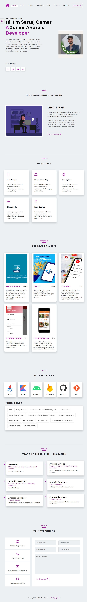

# Android Developer Portfolio

    **This portfolio website is designed for an Android developer, featuring a fully responsive in all devices.
    The site includes customizable settings, such as an option to adjust the font size throughout the website, catering to individual user preferences.
    Enhanced with various animations. Also It’s Built using HTML, CSS, and JavaScript, Bootstrap for responsive designs and FormSpree for efficient form handling.**

## Preview Details

 

### Technologies usedgit

- HTML
- CSS
- Javascript
- Bootstrap grid
- Media Query
- [ionicons](https://ionic.io/ionicons) for Icons
- [formspree](https://www.formspree.io) for form

### Preview

[#Live](https://github.com/Sartaj-Qamar)
